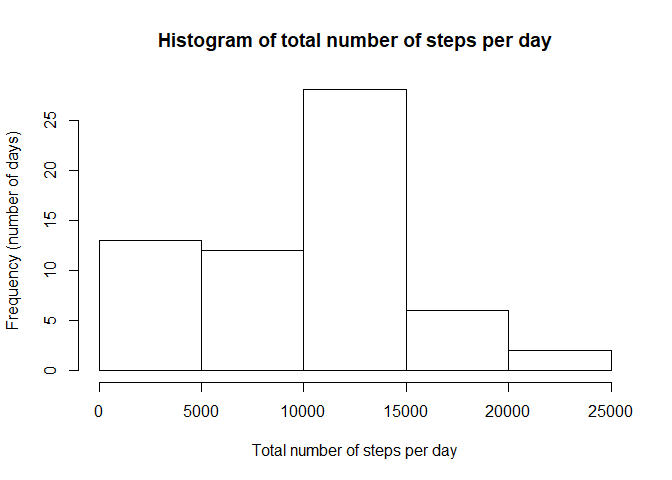
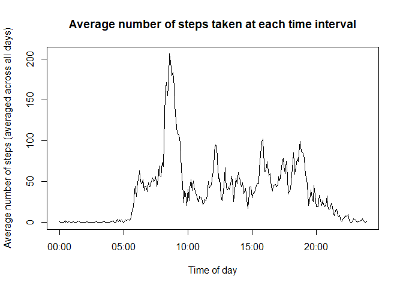
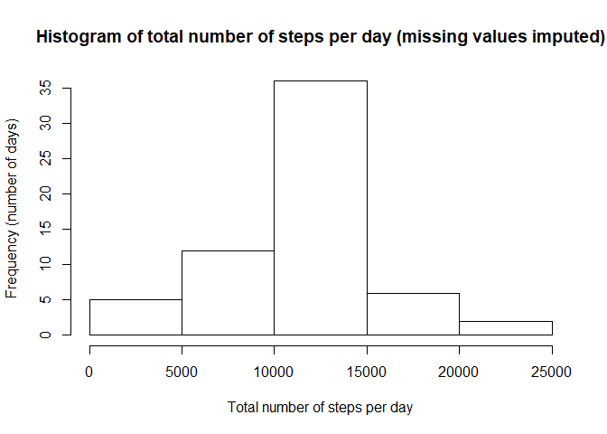
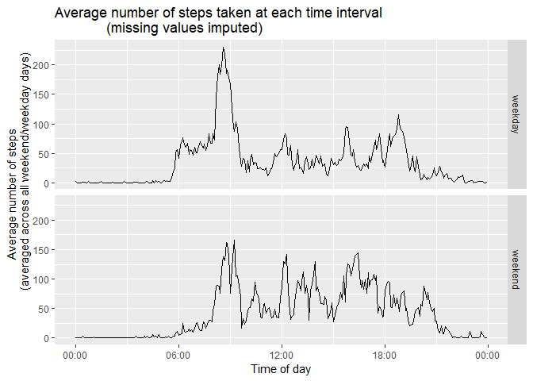

This assignment makes use of data from a personal activity monitoring device. 
The data can be found at [this link](https://d396qusza40orc.cloudfront.net/repdata%2Fdata%2Factivity.zip).
The activity monitoring device collects data at 5 minute intervals throughout
the day. The data consists of two months of data from an anonymous individual
collected during the months of October and November 2012 and include the number
of steps taken in 5 minute intervals each day.

## Loading and preprocessing the data

We assume that the working directory has been set to the folder that contains
the dataset with the filename "activity.csv" in the zip file "activity.zip". We 
unzip the file, load the dataset and convert the date column into the date class
in R.


```r
unzip("activity.zip")
data <- read.csv("activity.csv")
data$date <- as.Date(data$date)
```

Next, we convert the interval column into POSIXct format. To do so, we first
make it a factor class, change the labels into POSIXct format, then convert the
class back into POSIXct. Note that this also inserts the current date into the
interval column, but this doesn't matter as we'll only use the times.


```r
data$interval <- as.factor(data$interval)
first_interval <- strptime("00:00", format = "%H:%M")
last_interval <- strptime("23:55", format = "%H:%M")
time_list <- seq(first_interval, last_interval, length.out = 24*12)
levels(data$interval) <- time_list
data$interval <- as.POSIXct(data$interval)
```

## What is mean total number of steps taken per day?

Using the dplyr package, we group the data by day, and generate a histogram of
the total number of steps taken per day, ignoring NA values.


```r
library(dplyr)
```

```
## 
## Attaching package: 'dplyr'
```

```
## The following objects are masked from 'package:stats':
## 
##     filter, lag
```

```
## The following objects are masked from 'package:base':
## 
##     intersect, setdiff, setequal, union
```

```r
by_day <- data %>% group_by(date) %>% 
        summarise(total_steps = sum(steps, na.rm = TRUE))
hist(by_day$total_steps, 
     main = "Histogram of total number of steps per day",
     xlab = "Total number of steps per day",
     ylab = "Frequency (number of days)")
```

<!-- -->

We then calculate and report the median and mean number of steps taken per day.

```r
summary(by_day$total_steps)[3:4]
```

```
##   Median     Mean 
## 10395.00  9354.23
```

## What is the average daily activity pattern?

We then group the data by time intervals, and generate a time series plot of the
average number of steps taken (averaged across all days for each time interval),
ignoring NA values.


```r
by_time <- data %>% group_by(interval) %>% 
        summarise (avg_steps = mean(steps, na.rm = TRUE))
with(by_time, plot(interval, avg_steps, type="l",
                   main = "Average number of steps taken at each time interval",
                   xlab = "Time of day",
                   ylab = "Average number of steps (averaged across all days)"))
```

<!-- -->

We then calculate and print the starting time (in 24h format) of the interval
with the maximum number of steps (when averaged across all days).


```r
max_interval <- which.max(by_time$avg_steps)
format(by_time$interval[max_interval], "%H:%M")
```

```
## [1] "08:35"
```

## Imputing missing values

We first count and report the number of rows with NAs in the "steps" column.


```r
sum(is.na(data$steps))
```

```
## [1] 2304
```

We create a new dataset based on the original dataset, except that for each row 
X with an NA value under "steps", we replace the NA value with the mean value
for the time interval of X, averaged across all days where that time interval
does not have an NA value. E.g. if X is at time interval "08:00", we give X the
number of steps equal to the mean of the number of steps at "08:00", averaged
across all days, ignoring all NA values.


```r
data2 <- data
for (n in 1:nrow(data2)) {
        if (is.na(data2$steps[n])) {
                data2$steps[n] <- by_time$avg_steps[match(data2$interval[n], 
                                                         by_time$interval)]
        }
}
```

We use this new dataset to make a histogram of the total number of steps per day.

```r
by_day2 <- data2 %>% group_by(date) %>% 
        summarise(total_steps = sum(steps, na.rm = TRUE))
hist(by_day2$total_steps, 
     main = "Histogram of total number of steps per day (missing values imputed)",
     xlab = "Total number of steps per day",
     ylab = "Frequency (number of days)")
```

<!-- -->

We also use this new dataset to calculate and report the mean and median number
of steps taken per day.

```r
summary(by_day2$total_steps)[3:4]
```

```
##   Median     Mean 
## 10766.19 10766.19
```

By comparing this new histogram, and new median/mean figures with the ones
obtained in the first part of this assignment, we see that by imputing the
missing data, the following changes occur:

1. The distribution of total number of steps per day becomes more symmetrical. 
In particular, the number of days with a small number of total steps per day (up
to 5000) has decreased. This is because many of the days in this category would
have registered more total steps as a lot of their NA values (which were
previously ignored) would now have recorded a positive number of steps (the 
average number of steps in their respective time intervals).
2. The mean and median total number of steps per day has increased and become
equal. The increase is expected as more days would have registered more steps 
(since their NA values, which were previously ignored, would now have recorded a
positive number of steps). The equality of mean and median probably arises from
the distribution becoming more symmetrical (as in Point 1).

## Are there differences in activity patterns between weekdays and weekends?

We first create a new factor variable indicating whether each day happens on a
weekday or weekend, using the new dataset.


```r
weekend <- c("Saturday", "Sunday")
is.weekday <- function(x) {
        ifelse(x %in% weekend, "weekend", "weekday")
}
data2 <- mutate(data2, day = is.weekday(weekdays(date)))
data2$day <- as.factor(data2$day)
```

Then, we group the rows by (1) weekday vs. weekend, and (2) time interval.


```r
by_weekday <- data2 %>% group_by(day, interval) %>% 
        summarise(avg_steps = mean(steps))
```

We use ggplot to run a panel plot of the average number of steps taken across
time intervals, differentiating between weekdays and weekends. The scales
package is needed to format the x-axis tick labels.


```r
library(ggplot2)
library(scales)
ggplot(by_weekday, aes(interval, avg_steps)) + geom_line() + 
        scale_x_datetime(date_labels = "%H:%M") + facet_grid(day ~ .) +
        labs(title = "Average number of steps taken at each time interval
             (missing values imputed)", x = "Time of day", 
             y = "Average number of steps 
             (averaged across all weekend/weekday days)")
```

<!-- -->
